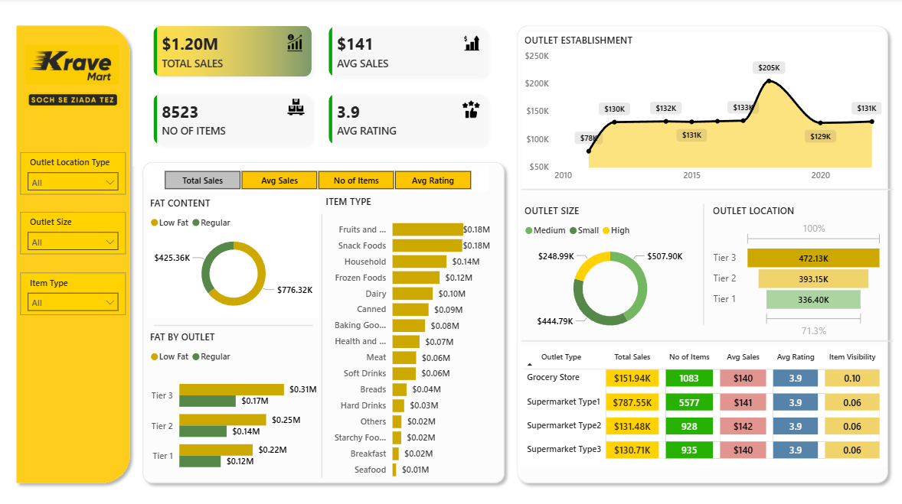

# 📊 Krave Mart Quick-Commerce Analytics Dashboard | Power BI

An interactive Power BI dashboard analyzing Krave Mart's sales performance, product trends, and outlet efficiency. This project delivers actionable insights to optimize operations in a fast-paced quick-commerce environment.

## 🔹 Project Overview
The dashboard provides a 360-degree view of Krave Mart's business metrics, enabling data-driven decisions on inventory, outlet performance, and customer satisfaction.

## 🛠 Tools Used
- **Power BI Desktop**
- **Power Query** (Data Transformation)
- **DAX** (Data Analysis Expressions)
- **Excel Files (.xlsx)** (Sales & Outlet Data)

## 📈 Key Insights
- **Total Sales, Avg Sales, Items Sold, & Avg Rating** KPIs
- Sales performance by **Product Category** and **Fat Content** (Low Fat/Regular)
- Revenue distribution across **Outlet Size, Location (Tier), and Type**
- Performance trends based on **Outlet Establishment Year**
- Customer rating analysis across all dimensions

## 📊 Dashboard Snapshot

## 📁 Files in this Repository
- `KraveMart_Performance_Dashboard.pbix` - Main Power BI dashboard file
- `Krave Mart Grocery Data.xlsx` - Primary Excel dataset
- `dashboard_snapshot.png` - Overview image of the dashboard
- `README.md` - Project documentation

## 🚀 How to Use
1.  Download the `.pbix` file and open it in **Power BI Desktop**.
2.  Ensure the data source path points to your `Krave Mart Grocery Data.xlsx` file.
3.  Refresh the data to load the latest information.
4.  Use the filters and slicers to interact with the dashboard and explore insights.

## 💡 Business Impact
- Identified top-selling item categories and optimal fat-content products.
- Pinpointed high-performing outlet types and locations for expansion strategy.
- Correlated customer ratings with product types to guide quality improvements.
- Enabled inventory optimization based on sales trends across outlet tiers.

---
